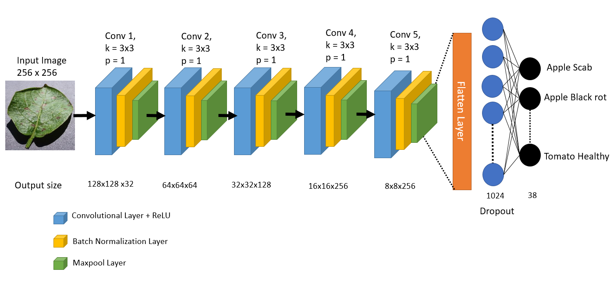
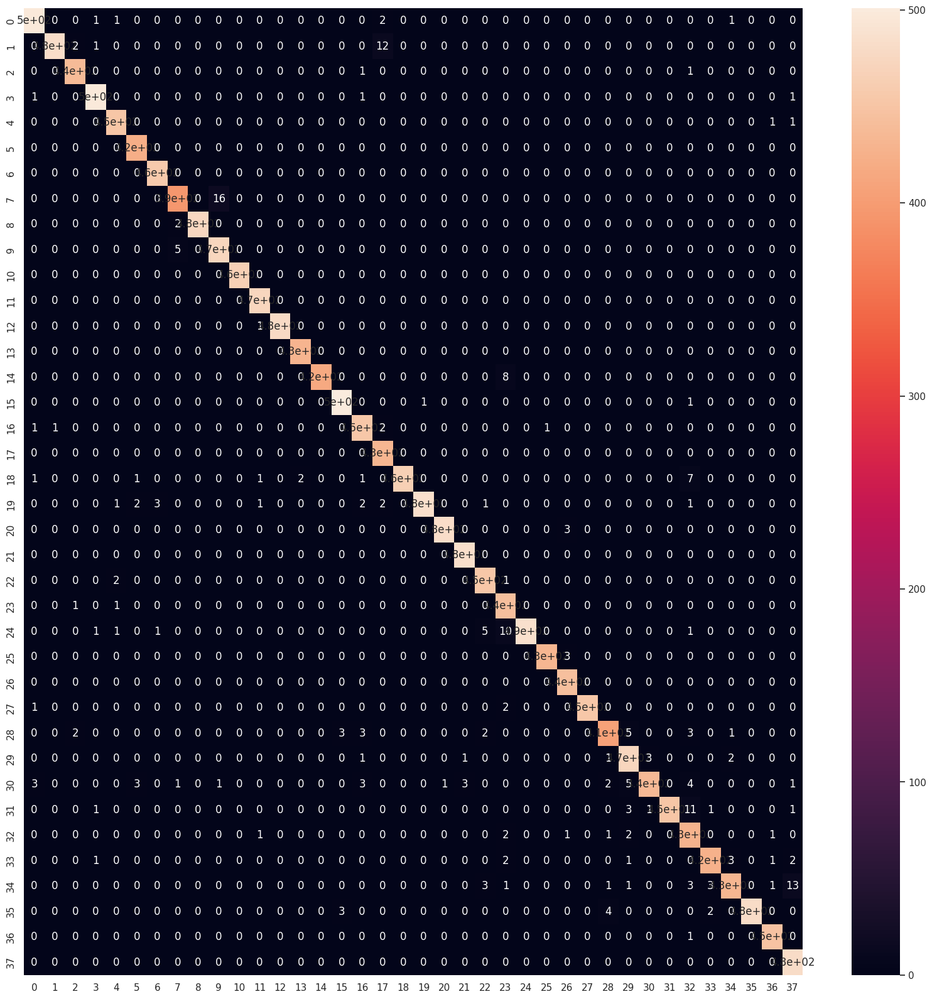
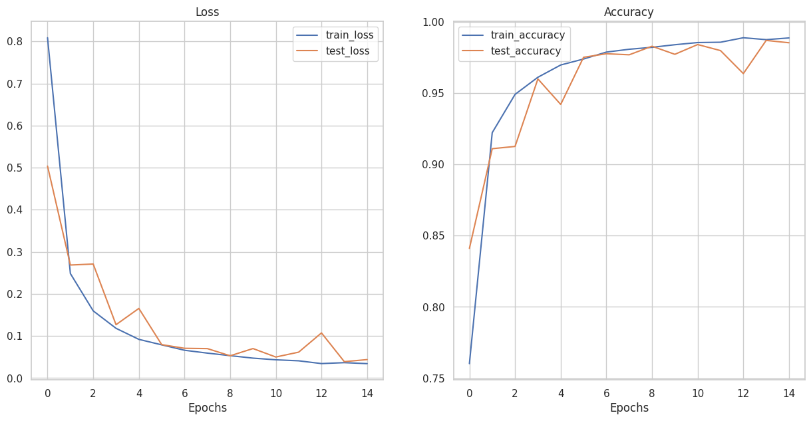
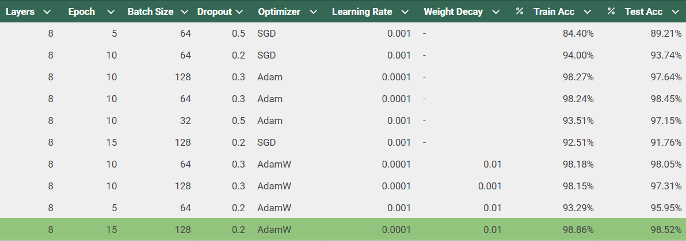
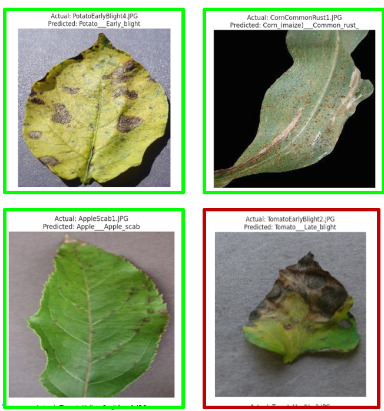

# Plant Disease Prediction Through Leaves using CNN

## Table of Contents
1. [Introduction](#introduction)
2. [Dataset](#dataset)
3. [Model Architecture](#model-architecture)
4. [Training Process](#training-process)
5. [Evaluation](#evaluation)
6. [Results](#results)
7. [License](#license)

## Introduction

This project implements a Convolutional Neural Network (CNN) to classify plant leaf images into different categories of diseased and healthy plants. The main goal is to design and train our custom CNN model that achieves high accuracy in image classification tasks.

### Problem Statement
Utilize Convolutional Neural Networks (CNNs) to accurately identify plant diseases from leaf images.

### Motivation
CNNs have revolutionized image classification tasks, and this project aims to explore their potential in a real-world dataset. By the end of this project, we aim to create a model that can classify images with high accuracy, showcasing the power of deep learning.

## Dataset

Dataset contains 70k plant images in train set and 18k test images

14 crop diseases : Apple,Blueberry,Cherry,Corn Grape,Orange,Peach,Pepper,Potato,Raspberry,Soybean,Squash,Strawberry,Tomato

Images of 17 fungal diseases,4 bacterial diseases,2 mold diseases,2 viral diseases and 1 disease caused by mites

### Dataset Overview
- **Classes**: 38 
- **Training Images**: 70,000
- **Test Images**: 18,000
- **Image Size**: 256x256 pixels, RGB
- **Source**: [PlantVillage Dataset](https://www.kaggle.com/datasets/vipoooool/new-plant-diseases-dataset)

### Data Preprocessing
To prepare the dataset for training, we:
- Normalize the pixel values 
- Perform data augmentation techniques such as veritcal and horizontal flip,color jitter to improve model generalization.

## Model Architecture

The CNN model used in this project consists of the following layers:

| Layer Type         | Output Shape    | Details                           |
|--------------------|-----------------|-----------------------------------|
| Conv2D + ReLU      | (128, 128, 32)   | Kernel size: 3x3, Padding: 1      |
| MaxPooling         | (64, 64, 32)     | Pool size: 2x2                    |
| Conv2D + ReLU      | (64, 64, 64)     | Kernel size: 3x3, Padding: 1      |
| MaxPooling         | (32, 32, 64)     | Pool size: 2x2                    |
| Conv2D + ReLU      | (32, 32, 128)    | Kernel size: 3x3, Padding: 1      |
| MaxPooling         | (16, 16, 128)    | Pool size: 2x2                    |
| Conv2D + ReLU      | (16, 16, 256)    | Kernel size: 3x3, Padding: 1      |
| MaxPooling         | (8, 8, 256)      | Pool size: 2x2                    |
| Flatten            | (8 * 8 * 256)    | Flattened output for FC layers    |
| Fully Connected    | (1024)           | Dense layer with ReLU activation  |
| Dropout            | (1024)           | Dropout rate: 0.2                 |
| Fully Connected    | (#Classes)       | Output layer with softmax         |

### Model Diagram

### Regularization Techniques
- **Dropout** is used after the fully connected layers to prevent overfitting.
- **Batch Normalization** is applied to improve convergence.

## Training Process

### Hyperparameters
- **Optimizer**: AdamW
- **Learning Rate**: 0.0001
- **Loss Function**: Cross-EntropyLoss
- **Batch Size**: 128
- **Epochs**: 15

The model was trained using the **Pytorch** framework. 

### Data Augmentation
To prevent overfitting and improve generalization, we applied the following augmentations:
- Horizontal flip
- Vertical flip
- Color Jitter

Training was done on a NVIDIA T4(kaggle) .

## Evaluation

After training the model, we evaluated it using the test set. The following metrics were calculated:

- **Accuracy**: 98.57%
- **Precision**: 0.986
- **Recall**: 0.9857
- **F1-Score**: 0.9857

### Confusion Matrix
Below is the confusion matrix showing the number of correct and incorrect predictions for each class:

### Loss and Accuracy Curves

## Results

The trained model achieves an accuracy of 98.6% on the test set. Below are some sample predictions:

## Experiments
Below are all the experiments i performed while training the model

### Sample Predictions

These results demonstrate that the model performs well for many classes but occasionally struggles with similar-looking categories.

## License

This project is licensed under the MIT License
